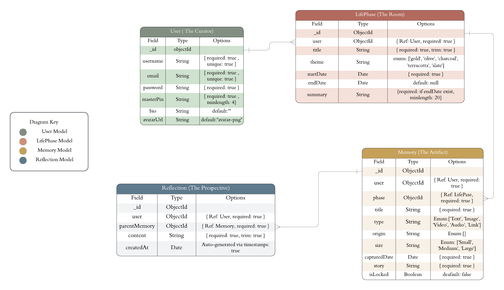

# 🏛️ Initial Project Plan: The Museum of Self

**Concept:** A private, intentional digital archive. The system uses a **Curator** metaphor to organize life into colored **"Rooms"** (Life Phases) containing **"Artifacts"** (Memories), featuring a dual-layer security system (Password + MasterPIN).

---

## 👤 User Stories: The Curator’s Journey

### 1. The Entrance (Security & Identity)
* **Secure Access:** As a Curator, I want to create an account with a password and a **MasterPIN** so my history is protected.
* **The Office:** As a Curator, I want to edit my profile (Bio, Location, and Avatar) so the "Museum" feels personal.

### 2. The Wings (Life Phases)
* **Visual Atmosphere:** As a Curator, I want to create a Life Phase with a **Theme Color** so the app's mood matches that era of my life.
* **Archiving Logic:** As a Curator, I want to "Close" a phase by adding an end date and a **Curator’s Statement** (Summary) to reflect on that chapter.

### 3. The Exhibits (Memories & Media)
* **Curation:** As a Curator, I want to upload memories and label their **Origin** (where it came from) and **Size** (how big it looks in the gallery).
* **Timeline:** As a Curator, I want to add a **Captured Date** to every memory so my artifacts are organized chronologically.

### 4. The Perspective (Reflections)
* **Layering History:** As a Curator, I want to add **Reflections** to old memories to track how my thinking has changed over time without overwriting original data.

---

## 📂 Data Models & Schema

### Entity Relationship Diagram (ERD)

### **Model 1: User (The Curator)**
* `username` / `password`: Basic authentication (Bcrypt hashed).
* `masterPin`: Hashed 4-6 digit code for Vault/Private access.
* `bio` / `avatarUrl`: Profile personalization.

### **Model 2: LifePhase (The Rooms)**
* `title`: Name of the life chapter.
* `theme`: Color key (Gold, Olive, etc.) for the **Theme Engine**.
* `summary`: Required only when `endDate` is set (Min. 20 characters).
* `startDate` / `endDate`: Time range of the phase.

### **Model 3: Memory (The Artifacts)**
* `title`: Name of the memory.
* `origin`: **Simple Categories** (*Self-Made, Gifted, Rediscovered, Soundtrack, Witnessed, etc.*).
* `size`: **Grid Scale** (*Small, Medium, Large*).
* `capturedDate`: The day the event actually happened.
* `story`: The description or notes.

### **Model 4: Reflection (The Perspective)**
* `parentMemory`: ObjectId (Link back to a specific Memory).
* `content`: The new thought or reflection text.
* `createdAt`: Automatically tracked timestamp to show the date of reflection.

---

## 🔗 Data Relationships

1. **User 1:M LifePhases** * *One curator owns many life chapters.*
2. **LifePhase 1:M Memories** * *A specific room acts as a container for many artifacts.*
3. **Memory 1:M Reflections** * *A single memory can have a timeline of new thoughts "stacked" under it.*

---

