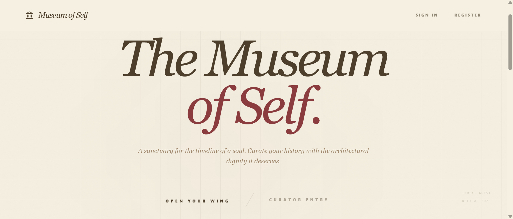
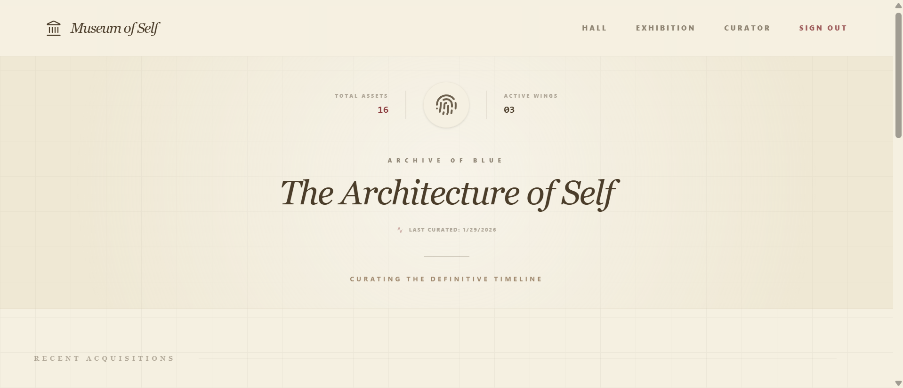
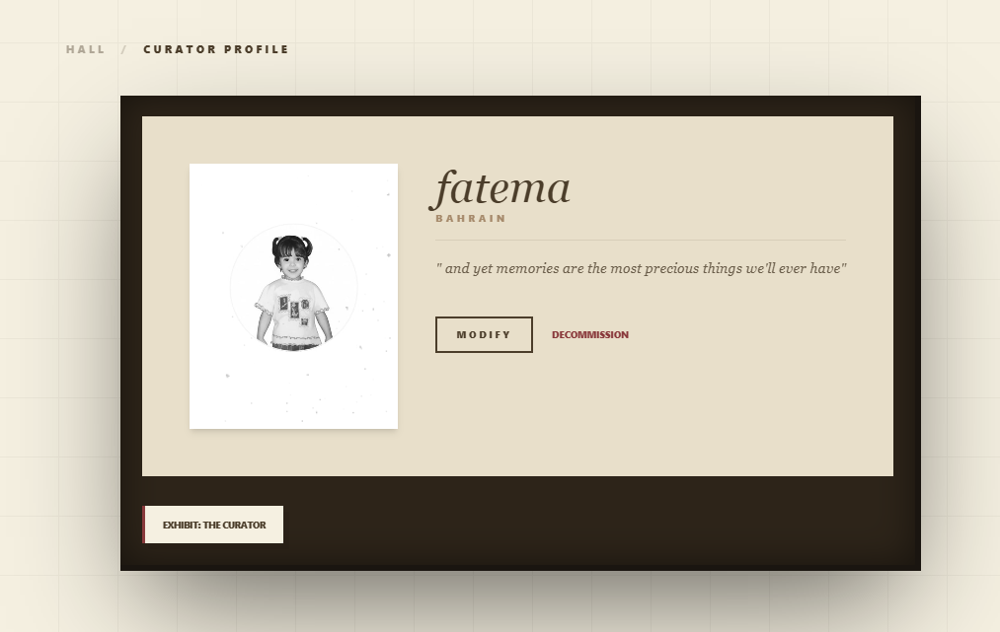
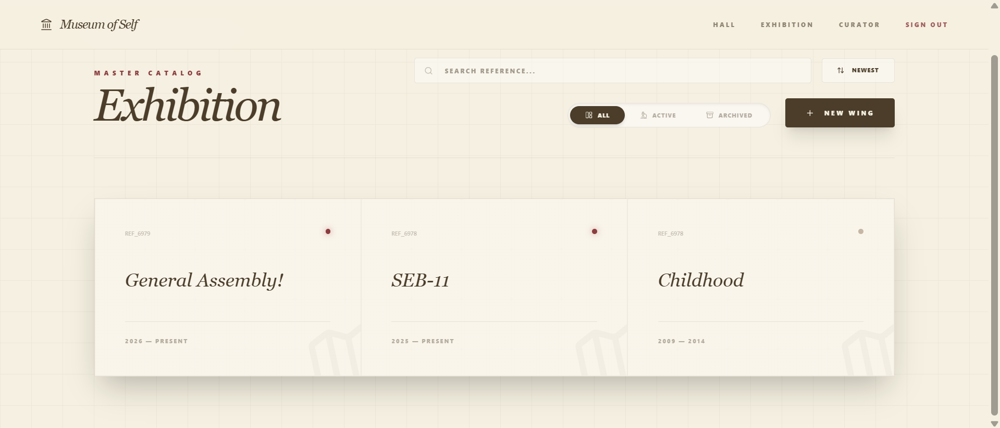
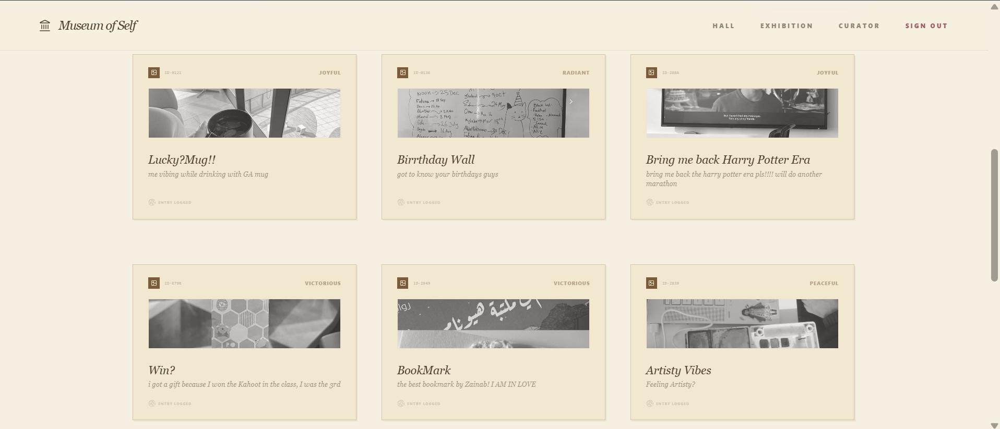
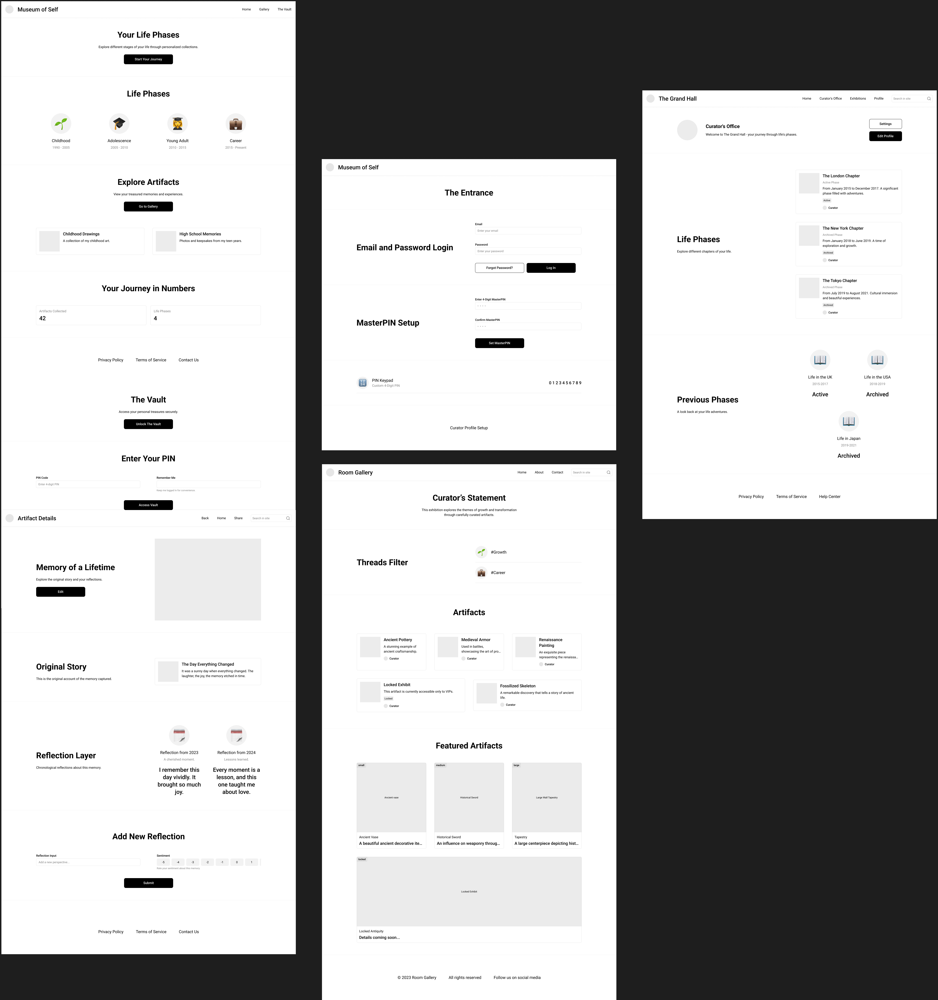

# 🏛️ Museum of Self: Frontend

A specialized MERN-stack application for personal archiving, where users become the curators of their own history. 

> **Looking for the API?**
> Visit the [Museum of Self Backend Repository](https://github.com/fatemamoh/Museum-of-self-Backend) to see how the vault is managed.

---

## 📸 Exhibition Preview

### Landing Page


### The Curator's Vault (Dashboard)


### Profile 


### Exhibition - Lifephase


### Artifact - Memories 



---

## 📂 Data Models & Schema

### Entity Relationship Diagram (ERD)


### Wireframe of the Workflow



---

## 📖 Description

**Museum of Self** is a digital preservation platform designed to help individuals curate their life journey. It centralizes the personal narrative into one platform, offering:
* **Intentionality**: Focuses on deep reflection rather than social validation.
* **Chronology**: Visualizes your life through distinct, valid time periods (Life Phases).
* **Growth Tracking**: Measures personal development through a quantitative growth scale for every reflection.

---

## 👥 Functionality

### 🧑‍🎨 The Curator (User)
* **Manage Exhibitions**: Create and finalize Life Phases with custom Curator Statements.
* **Catalog Artifacts**: Upload memories with titles, stories, and mood tags (e.g., *Radiant, Melancholic, Victorious*).
* **Deep Reflection**: Attach perspectives to artifacts categorized by *Growth, Gratitude, or Closure*.
* **Media Support**: Seamlessly upload images, audio, and video via Cloudinary.


---

## 🚀 Getting Started

Follow these steps to run the Museum of Self frontend locally:

### 1. Clone the Repository

```bash
git clone https://github.com/fatemamoh/Museum-of-self-Frontend
cd Museum-of-self-Frontend
```

### 2. Install Dependencies

```bash
npm install
```

### 3. Environment Setup

Create a `.env` file in the root directory and add:

```env
VITE_BACKEND_URL=http://localhost:3000
```

### 4. Start the Development Server

```bash
npm run dev
```

---

## 🛠️ Technologies Used

### Frontend

- **React (Vite)** — Fast component-based UI development  
- **Tailwind CSS & DaisyUI** — Museum-inspired styling + accessible UI components  
- **Lucide React** — Elegant curatorial iconography  
- **Axios** — Secure API communication  

### Backend Integration

- **Node.js & Express** — API routing and application logic  
- **MongoDB** — Persistent storage for memories, phases, and user data  
- **Cloudinary** — Media processing, storage, and optimization  

---

## 🔐 Authentication & Authorization

- **JWT Authentication**  
  Secure Sign Up, Sign In, and Sign Out with JSON Web Tokens  

- **Protected Routes**  
  Curatorial dashboard and private wings guarded by frontend auth + backend middleware  

- **Credential Recovery**  
  Full password reset integration through themed email service  

- **Data Security**  
  Industry-standard password hashing with **Bcrypt**  

---

## 🔮 Next Steps (Future Enhancements)

Planned expansions for the museum:

- 🎞️ **Museum Tour Mode**  
  Cinematic slideshow of memories from a chosen life phase  

- 🎙️ **Audio Narrations**  
  Record voice notes directly into an artifact  

- 📄 **Curator Export**  
  Export life phases and reflections into a digital PDF Exhibition Catalog  

- 📊 **Advanced Analytics**  
  Visualize mood trends and growth patterns across life eras  

---

## 📜 Attributions

- Icons — **Lucide React**  
- UI Styling — **Tailwind CSS & DaisyUI**  
- Backend Integration — **Museum of Self API**  
- Email Service — Powered by **Nodemailer**  

---

✨ *Museum of Self is not a social platform — it is a personal archive of meaning, memory, and growth.*